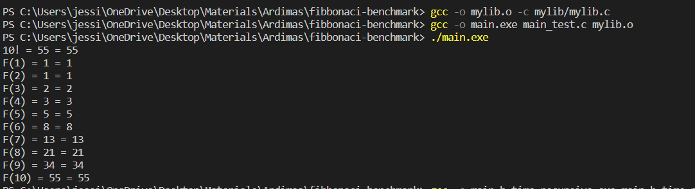
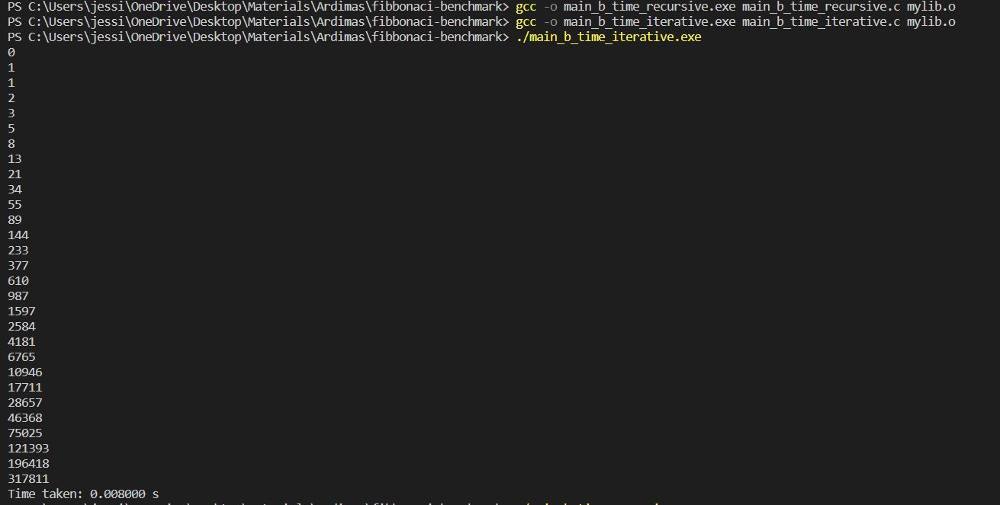
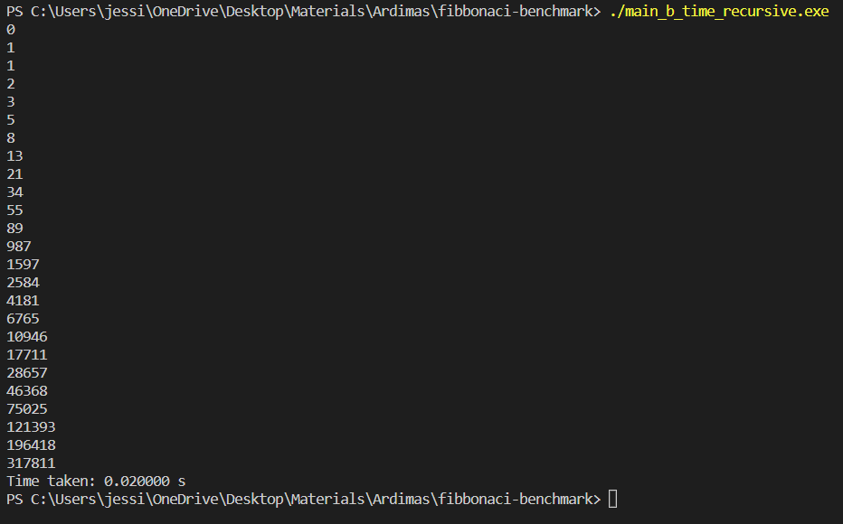

# Fibonacci Series
The Fibonacci sequence is a series of integers (Fibonacci numbers) that starts with 0, is followed by 1, followed by another number, and is a steadily increasing sequence of numbers. The sequence follows the rule that each number is equal to the sum of his two preceding numbers.

## Fibonacci Series using Iterative Method
The following is the code for Fibonacci Series using Iterative Method

```c
int fibonacciIterative(int N){
    // iterative method
    if (N ==0){
        return 0;
    } else if (N == 1){
        return 1;
    } else {
        int num1 = 0;
        int num2 = 1;
        int output;
        for (int i = 2; i <= N; i++){
            output = num1 + num2;
            num1 = num2;
            num2 = output;
        }
        return output;
    }
}
```

## Fibonacci Series using Recursive Method
The following is the code for Fibonacci Series using Recursive Method

``` c
int fibonacciRecursive(int N){
    // recursive method
    if (N == 0){
        return 0;
    } else if (N == 1){
        return 1;
    } else {
        return fibonacciRecursive(N-1) + fibonacciRecursive(N-2);
    }
}
```

## Testing
In this section, I will show how to test out both of the approaches and its outputs.

### Run and output:


## Benchmark
In this section, I will assess the performances of both iterative and recursive approaches through their time and space complexity.

### Time Complexity run and output



As you can see from the both of the outputs, using the iterative approach is faster than the recursive approach.

### Space Complexity run and output


As you can see from the both of the outputs, the iterative approach takes lesser space than the recursive approach.

## Conclusion
In summary, iterative approximation of the Fibonacci sequence is more efficient and saves wasted time and space.